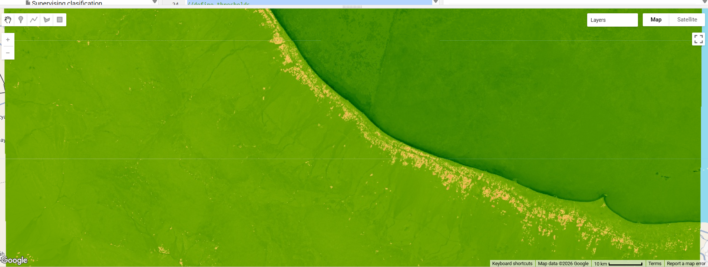

# 🌍 Vegetation, Water, and Environmental Analysis using Google Earth Engine

## 📌 Project Overview

This project uses **Google Earth Engine (GEE)** and **Sentinel-2 satellite imagery** to analyze environmental conditions in **Al Batinah (Sohar), Oman**.

The main objective is to detect and map:

* 🌱 Vegetation distribution using NDVI
* 💧 Water bodies using NDWI
* 🛰️ Surface characteristics using RGB imagery

---

## 🛰️ Data Source

* **Sentinel-2 Surface Reflectance**
  Dataset: `COPERNICUS/S2_SR_HARMONIZED`

* **Time Period:**
  January 2024 – August 2024

* **Study Area:**
  Al Batinah Region (Sohar), Oman

---

## 📊 Indices Used

### 🌱 NDVI (Normalized Difference Vegetation Index)

* Measures vegetation density and health
* High values → Dense vegetation
* Low values → Bare soil or urban areas

---

### 💧 NDWI (Normalized Difference Water Index)

* Identifies water bodies
* Helps distinguish water from land

---

## ⚙️ Methodology

1. Filter Sentinel-2 imagery over the study area
2. Apply date filtering
3. Generate median composite image
4. Calculate indices:

   * NDVI = (B8 - B4) / (B8 + B4)
   * NDWI = (B3 - B8) / (B3 + B8)
5. Apply thresholding for feature extraction:

   * Water detection: NDWI > 0.1

---

## 🗺️ Results

### 🌱 NDVI (Vegetation)

---

### 💧 NDWI (Water Bodies)

---

### 🛰️ RGB Image

---

## 💡 Key Insights

* Coastal areas show higher vegetation density
* Water bodies are clearly detected using NDWI
* The region exhibits a mix of urban, coastal, and natural landscapes

---

## 🚀 Future Improvements

* Add burn scar detection using NBR
* Apply machine learning classification
* Integrate results with solar energy site suitability analysis
* Use time-series analysis for environmental change detection

---

## 👩‍💻 Author

GIS Graduate | Sultan Qaboos University
Research interests: Remote Sensing, Environmental Analysis, GIS Applications
